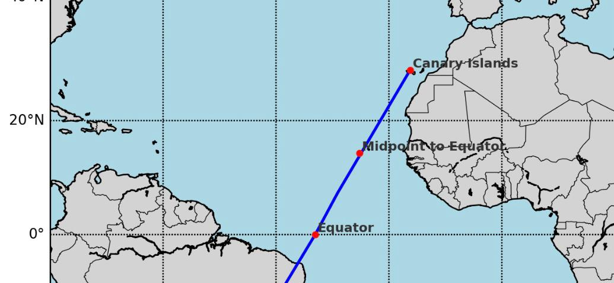

#Leg1 Sector3

This sector was divided into 3 main loactions for data collection as shown in this diagram.

Data Metrics and Scripts

| Data Metric | Source | Variables | Top Level Script |
| :---------- | :----- | :-------- | ---------------- |
| Windspeed/Direction at 10m | [Copernicus ERA5 hourly data on single levels from 1940 to present](https://cds.climate.copernicus.eu/datasets/reanalysis-era5-single-levels?tab=overview) | 10m_v_component_of_wind 10m_u_component_of_wind | FetchAndDump10MWind.sh |

